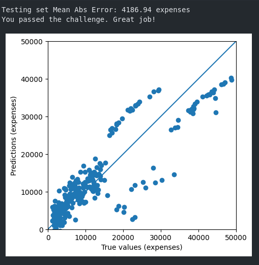

<h1> Linear Regression Health Costs Calculator - ML Python Project</h1>
 
<h2>Features</h2>
<li>Convert categorical data to numbers</li>
<li>Use 80% of the data as the train_dataset and 20% of the data as the test_dataset</li>
<li>Use Linear Regression and train it</li>
<li>Return a Mean Absolute Error of under 4500. This means it predicts health care costs correctly within $4500</li>
<h2>Acknowledgments</h2>

<b> Python3: http://bit.ly/python3-certifications <b>
 

<h2>Photo</h2>

 

<h2>Links</h2>
<li>FreeCodeCamp Project: https://www.freecodecamp.org/learn/machine-learning-with-python/machine-learning-with-python-projects/linear-regression-health-costs-calculator</li>
<h2>Contact</h2>

<b> Email: mariusc0023@gmail.com </b>
